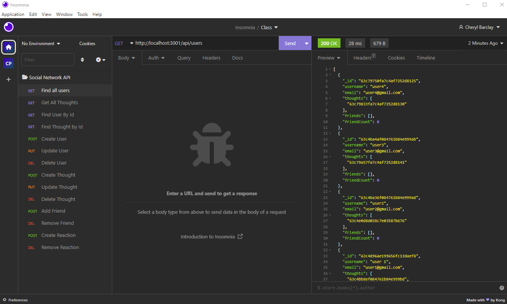

<h1 align="center"> Social Network API </h1>
 

<p align="center">
    
    
    
    
</p>

<p align="center">
    
    
    
    
    
    
</p>

## Table of Contents
* [Description](#description)
* [User Story](#user-story)
* [Acceptance Criteria](#acceptance-criteria)
* [Insomnia Screenshot](#insomnia-screenshot)
* [Technology](#technology) 
* [Installation](#installation) 
* [Usage](#usage) 
* [Features](#features)
* [Video Demonstration](#video-demonstration)
* [Contact Me](#contact-me)
* [Credits](#credits)
* [Testing](#testing)
* [Questions](#questions)
* [License](#license)

## Description
This application is API for a social network web application where users can share their thoughts, react to friends’ thoughts, and create a friend list. It has been built with MongoDB because of its speed with large amounts of data and flexibility with unstructured data.
 
## User Story
AS A social media startup<br>
I WANT an API for my social network that uses a NoSQL database<br>
SO THAT my website can handle large amounts of unstructured data<br>
 
## Acceptance Criteria
GIVEN a social network API<br>
WHEN I enter the command to invoke the application<br>
THEN my server is started and the Mongoose models are synced to the MongoDB database<br>
WHEN I open API GET routes in Insomnia for users and thoughts<br>
THEN the data for each of these routes is displayed in a formatted JSON<br>
WHEN I test API POST, PUT, and DELETE routes in Insomnia<br>
THEN I am able to successfully create, update, and delete users and thoughts in my database<br>
WHEN I test API POST and DELETE routes in Insomnia<br>
THEN I am able to successfully create and delete reactions to thoughts and add and remove friends to a user’s friend list

## Insomnia Screenshot


## Technology
This project has been created with:

- Javascript
- Node.js
- Express.js
- MongoDB
- Mongoose
- Moment

## Installation
To setup the application in local, run `npm i` to install the below packages. 

    * express
    * mongoose
    * moment

## Usage
After installing npm packages, the application will be invoked by using the following command:

```
npm start
```

## Features
* Uses the Mongoose package to connect to a MongoDB database.
* Includes User and Thought models. 
* Includes schema settings for User and Thought models. 
* Includes Reactions as the reaction field's subdocument schema in the Thought model.
* Uses functionality to format queried timestamps properly.

## Video Demonstration
[Click here to see the demo video!](https://drive.google.com/file/d/1QFEJ4rg9yn1scgb3ct0I9HJVaRfbJNXd/view)
 
## Contact Me
* GitHub: [CheBar1](https://github.com/CheBar1)
* Email: findme@gmail.com

## Credits
* University of Adelaide - Coding Bootcamp;
* GitHub;
* Youtube.com;

## Testing
APIs were tested using Insomnia: https://insomnia.rest/

## Questions
Please send your questions [here](mailto:findme@gmail.com?subject=[GitHub]%20Dev%20Connect) or visit [github/CheBar1](https://github.com/CheBar1).

## License
[](https://opensource.org/licenses/MIT) <br>
This project is licensed under MIT, for more information please visit [this website](https://opensource.org/licenses/MIT)
